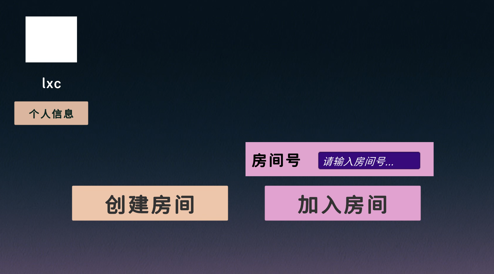
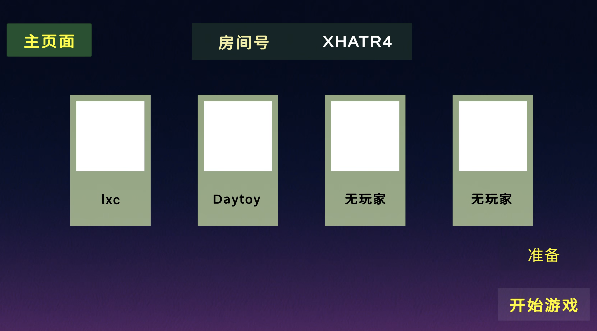
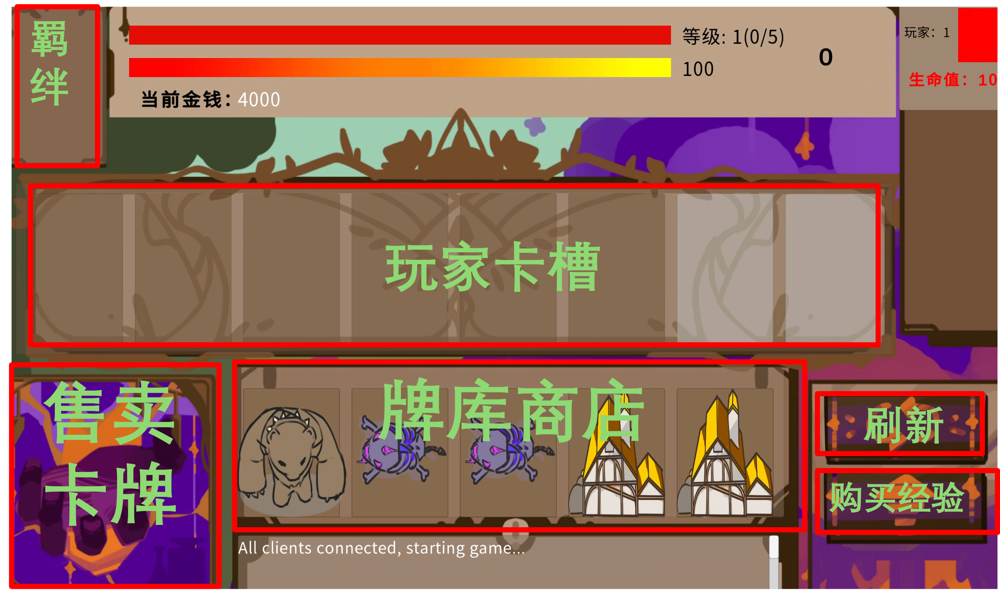

# BattleOfBuaa-Release


**《Battle of BUAA》是一款融合娱乐与博弈的多人对战策略类手游。**

在游戏中，玩家需要灵活招募各类英雄，巧妙搭配羁绊，打造专属强力阵容。在不断变化的战局中运筹帷幄，击败对手，最终登顶战场，赢得胜利！

在这里你可以获取Battle of BUAA的最新Release版本，我们同样欢迎在此仓库提交issue，帮助我们完善游戏。

**游戏宣传视频**

请在Bilibili上观看我们的视频！[Battle of BUAA](https://www.bilibili.com/video/BV1d353zyE58/)


## 游戏启动方式

由于我们的服务器算力资源和网络带宽有限，在测试阶段，《Battle of BUAA》提供了2种游戏启动的支持。玩家既可以在我们的游戏专用服务器中直接进行游戏；也可以使用在测试模式本地运行游戏服务器，从而提供更加稳定的游戏体验。

### 方式一：直接运行游戏客户端

1. 玩家可以通过直接运行客户端进行游戏。通过邮箱与密码进行登录。


2. 登录游戏后进入主页。目前游戏尚不支持在线匹配，支持2~4名玩家通过建立房间进行游戏。玩家可以选择创建房间，或是加入已有的房间。



​	待所有玩家准备好后，房主即可以开启游戏并进入准备阶段。



### 方式二：在本地运行游戏服务

由于我们的服务器算力资源和网络带宽有限，在测试阶段，Battle of BUAA支持在测试模式本地运行游戏服务器，从而提供更加稳定的游戏体验。

为了在本地运行游戏服务，你需要一个人作为主机，以服务器模式运行Battle of BUAA，其他人通过命令行加入游戏，加入游戏后会跳过房间和组队，直接进入游戏。

#### 服务器端
命令行运行
```
<Battle Of BUAA executable> --server --test --port=<port to run server> --playerNum=<player count>
```
其中，executable就是Battle of BUAA的可执行文件（windows下的exe文件，macos下app包中`Content/MacOS/`下的可执行文件。其中，`port`指定服务端运行的端口，`playerNum`指定玩家数量

#### 客户端
命令行运行
```
<Battle Of BUAA executable> --test --ip=<ip of your server> --port=<port of the server>
```
其中，`ip`是运行服务端的主机公网ip地址，`port`是服务端运行端口


## 游戏操作指南

游戏分准备阶段和对战阶段。每局游戏开始将首先进入准备阶段，每回合对战结束后也将进入准备阶段。

### 准备阶段

准备阶段界面各部分功能解释如下：



1. 玩家将从牌库商店中购买卡牌。对于相同的卡牌，重复购买将能够使英雄升星。**升星规则**：2张升2星，6张升3星。
2. 玩家可以刷新牌库商店，获得新的一组待购买卡牌；或选择购买经验来进行升级。刷新与购买经验均需要花费一定金币。
3. 玩家购买卡牌后，激活的羁绊将显示在左上角的羁绊栏当中。
4. 鼠标悬停在对应卡牌上，将显示该卡牌更加详细的信息。
5. 玩家可拖动卡槽中的卡牌到售卖区进行售卖。

### 对战阶段

对战阶段各部分功能解释如下：


1. 玩家进入对战环节后，普通卡槽中的卡牌将随机显示3张在右侧栏目。玩家点击卡牌并拖动，即可将其召唤至场上。每次召唤卡牌将**消耗食物**，食物的恢复速度与最大值和玩家等级有关。召唤卡牌后，该卡槽中的卡牌将被**随机替换**。
2. 玩家升至4级后，将解锁特殊卡槽。特殊卡槽中的卡牌使用后不会被刷新，但会有CD。
3. 玩家的目标是合理**召唤自己组建的阵容英雄，摧毁地方王座**。并守护自己的建筑。
4. 每次失败后玩家会损失一定血量，血量归零时该玩家出局。


## 获取游戏攻略

想要更深入了解我们的卡牌与羁绊细节，技能机制？欢迎关注我们的官方攻略网站：

https://buaase-2026.github.io/battleofbuaa.github.io/

我们将会在此更新最完整的卡牌和羁绊信息，分享阵容推荐与战术指南。

你也可以通过邮件向我们投稿：tougao@battleofbuaa.cn
